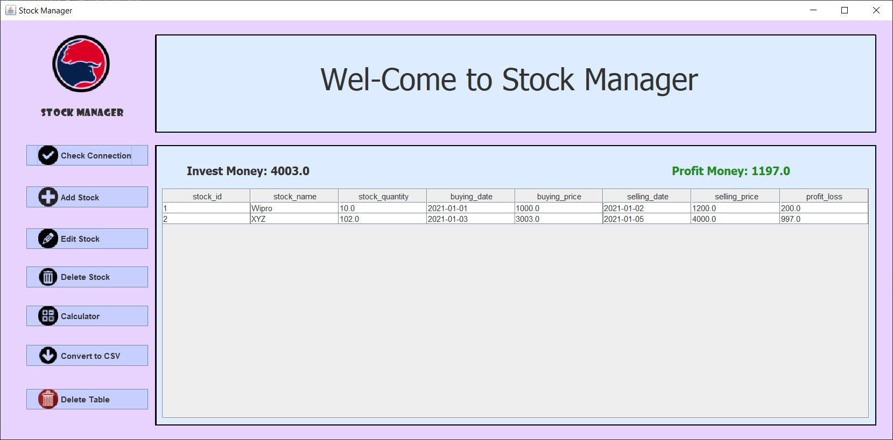
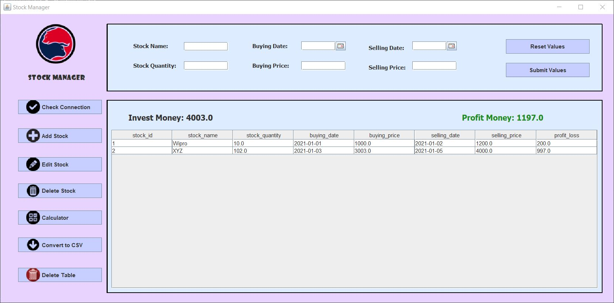
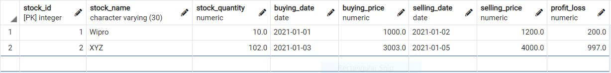

# Stock-Manager-using-java-and-postgresql

## Tech used: 
1)JavaGUI    :- To learn more visit : https://docs.oracle.com/cd/E40938_01/doc.74/e40142/run_java_guis.htm
2)JDBC       :- To learn more visit :https://docs.oracle.com/javase/tutorial/jdbc/basics/index.html
3)PostgreSQL :- To learn more visit :https://www.postgresql.org/docs/current/

This is a simple java project in which a user can manage/track their stock activities. This project allows user to add the stock, edit stock, delete stock, delete the table, and to convert the data entries into sharable .csv formate.

## 1)Main GUI:

## 2)Add Stock:

## Note: First of all create on PostgreSQL table as shown in below image and keep the column names as it is.

## 3)PostgreSQL Table:

